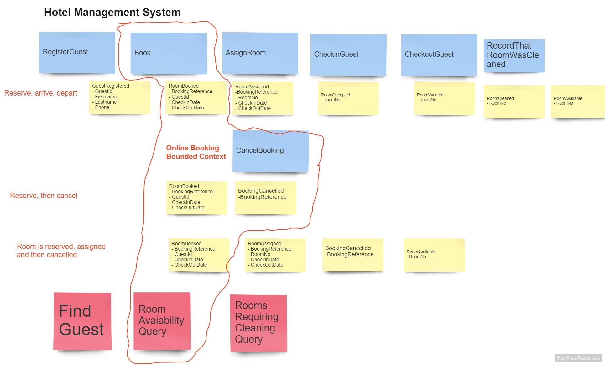

# Eventsourcing & CQRS demo: Hotel Booking System

Sample implementation of an aggregate and read models from the "Online Booking System" bounded context we identified in http://www.meetup.com/DDD-CQRS-ES/events/232482868/ .




## TODO

- Implement "CancelBooking" command.
- Fail if a 2nd reservation with the same reservationId is made.
- Fail if a 2nd room type with the same roomTypeId is created.
- Improve exception handling.

## API:

### Create a room type (Double, Single, ...) and the number of units available:
```
curl -X POST -H "Cache-Control: no-cache" "Content-Type: multipart/form-data; boundary=----WebKitFormBoundary7MA4YWxkTrZu0gW" -F "name=Double" -F "NoOfUnits=3" "http://127.0.0.1:9000/rooms/types"
```

### Get a list of all room types
```
curl -X GET -H "Cache-Control: no-cache" "http://127.0.0.1:9000/rooms/types"
```

### Vacancies query
```
curl -X GET -H "Cache-Control: no-cache" "http://127.0.0.1:9000/rooms/vacancies?checkin=2016/6/20&checkout=2016/6/21"
```

### Make a reservation
```
curl -X POST -H "Cache-Control: no-cache" -H "Content-Type: multipart/form-data; boundary=----WebKitFormBoundary7MA4YWxkTrZu0gW" -F "checkindate=6/20/2016" -F "checkoutdate=6/21/2016" -F "roomtypeid=94611db0-56f8-4a12-bd5b-f31ff0a26812" -F "guestid=guestid-1" -F "id={890934F1-EDB8-4590-8432-0EEA8CB9EF84}" -F "noofunits=1" "http://127.0.0.1:9000/rooms/reservations"
```
